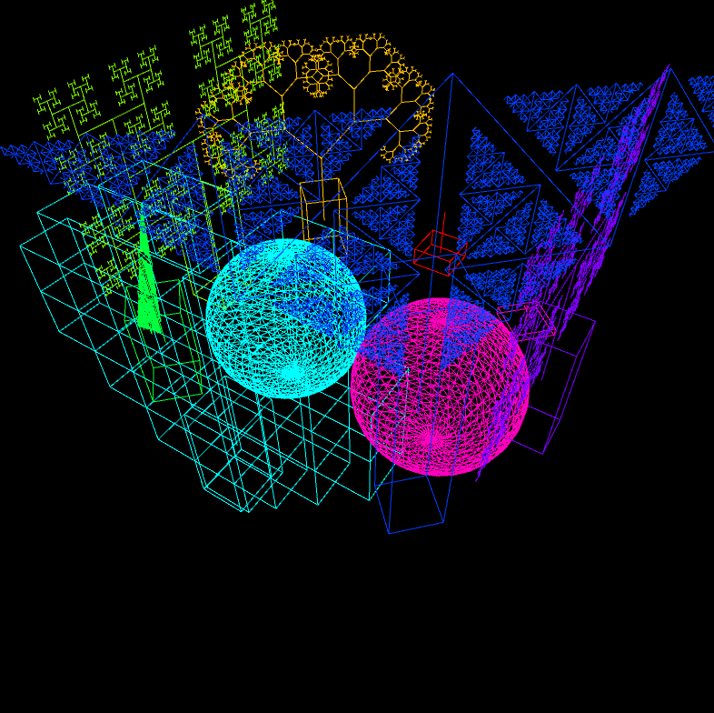

# Music Visualiser Project

Name:
Xinyu Zhang 
Student Number: 
D18130496

## Instructions
- Fork this repository and use it a starter project for your assignment
- Create a new package named your student number and put all your code in this package.
- You should start by creating a subclass of ie.tudublin.Visual
- There is an example visualiser called MyVisual in the example package
- Check out the WaveForm and AudioBandsVisual for examples of how to call the Processing functions from other classes that are not subclasses of PApplet

# Description of the assignment
This assignment is about the use of ddf.minim package, and how to use the frequency and volume of sound to present its effect through processing

# How it works
run the Main in ie.tudublin.D18130496
# What I am most proud of in the assignment

- The loudness of the fractal response is used

# Result
-screenshot:

-vedio:
